# QVAC QA Process - Quick Reference Guide

## Process Overview
The QVAC Quality Assurance Process is a comprehensive three-phase methodology ensuring the highest quality standards throughout the software development lifecycle.

## Visual Process Flow

```mermaid
flowchart TD
  %% Phase 1: Planning and Strategy
  A[Feature/Epic Proposed] --> B[QA Team Reviews Requirements]
  B --> C{Requirements Clear & Testable?}
  C -->|No| D[Provide Feedback to Product & Dev Teams]
  D --> B
  C -->|Yes| E[Create Test Strategy & Plan within Testpad or similar]
  E --> F[Define Test Scope, Types & Resources]
  F --> G[Write Detailed Test Cases]
  G --> H[Link Test Cases to Asana Ticket]
  H --> I{Definition of Done Agreed?}
  I -->|No| J[Hold DoD Definition Meeting]
  J --> I
  I -->|Yes| K[Move to Development Phase]

  %% Phase 2: Development and Testing
  K --> L[Ticket Moved to 'In Progress']
  L --> M[Developer Begins Work]
  M --> N[Write Unit & Integration Tests]
  N --> O[Commit Code & Create PR]
  O --> P[CI/CD Pipeline Runs Tests]
  P --> Psec[Run Security Scan on PR - SAST and Secrets]
  Psec --> Q{PR Reviewed & Approved?}

  Q -->|No| R[Address Feedback & Update Code]
  R --> O
  Q -->|Yes| S[Merge PR & Deploy to Staging]
  S --> T[Developer Quality Gate Check]
    
  %% Developer Quality Gate Details
  T --> T1{Happy Path Working?}
  T1 -->|No| R
  T1 -->|Yes| T2{All Tests Passed?}
  T2 -->|No| R
  T2 -->|Yes| T3{Artifacts Published?}
  T3 -->|No| T4[Publish Artifacts & Links]
  T4 --> T3
  T3 -->|Yes| U[Move to 'Ready for QA']
    
  U --> V[QA Team Begins Testing]
  V --> W[Move to 'In QA' Swimlane]
  W --> X[Execute Test Cases & Exploratory Testing]
  X --> Y{Definition of Done Met?}
  Y -->|No| Z[Create Bug Report & Link to Ticket]
  Z --> AA[Move Back to 'In Progress']
  AA --> M
  Y -->|Yes| BB[QA Lead Signs Off]
  BB --> CC[Move to 'Complete' Swimlane]

  %% Phase 3: Release and Maintenance
  CC --> DD[Release Scheduled]
  DD --> EE[Run Full Regression Test Suite]
  EE --> FF[QA Lead Reviews Project Health Dashboard]
  FF --> GG{Quality Meets Release Criteria?}
  GG -->|No| HH[Issue 'No-Go' Warning]
  HH --> II[Address Critical Issues]
  II --> GG
  GG -->|Yes| JJ[Formal 'Go' Recommendation]
  JJ --> KK[Release Proceeds]
  KK --> LL[Monitor Production]
  LL --> MM[Hold Retrospective]

  %% Support Channel Management
  NN[Issue Reported via Support Channel] --> OO[Create Ticket in QA Support Project]
  OO --> PP[Weekly QA Triage Review]
  PP --> QQ[Ensure Clear Reproducible Steps]
  QQ --> RR{Issue Priority?}
  RR -->|High Priority P1/P2| SS[Immediate Escalation]
  SS --> TT[Add to Current Sprint]
  TT --> M
  RR -->|Low Priority P3/P4| UU[Add to Product Backlog]
  UU --> VV[Review in Sprint Planning]
  VV --> WW{Include in Future Sprint?}
  WW -->|Yes| M
  WW -->|No| UU

  %% Styling with improved text contrast and distinct Quality Gates
  classDef phase1 fill:#b3e5fc,stroke:#01579b,stroke-width:2px,color:#000000
  classDef phase2 fill:#e1bee7,stroke:#4a148c,stroke-width:2px,color:#000000
  classDef phase3 fill:#c8e6c9,stroke:#1b5e20,stroke-width:2px,color:#000000
  classDef support fill:#ffe0b2,stroke:#e65100,stroke-width:2px,color:#000000
  classDef decision fill:#fff9c4,stroke:#f57f17,stroke-width:2px,color:#000000
    
  %% Quality Gates with distinct styling
  classDef requirementsGate fill:#ff9800,stroke:#e65100,stroke-width:4px,color:#ffffff
  classDef devQualityGate fill:#f44336,stroke:#c62828,stroke-width:4px,color:#ffffff
  classDef qaValidationGate fill:#9c27b0,stroke:#6a1b9a,stroke-width:4px,color:#ffffff
  classDef releaseGate fill:#2196f3,stroke:#1565c0,stroke-width:4px,color:#ffffff

  %% Apply styles with distinct Quality Gates
  class A,B,D,E,F,G,H,J,K phase1
  class L,M,N,O,P,Psec,R,S,T4,U,V,W,X,Z,AA,BB,CC phase2
  class DD,EE,FF,HH,II,JJ,KK,LL,MM phase3
  class NN,OO,PP,QQ,SS,TT,UU,VV support
  class Q,RR,WW decision
    
  %% Quality Gates highlighted
  class C,I requirementsGate
  class T,T1,T2,T3 devQualityGate
  class Y qaValidationGate
  class GG releaseGate

  %% Quality Gates Legend:
  %% Orange (Requirements Gate): Requirements clarity and DoD agreement
  %% Red (Developer Quality Gate): Developer validation checkpoints
  %% Purple (QA Validation Gate): QA sign-off and DoD verification
  %% Blue (Release Gate): Release readiness decision
```

## Three Main Phases

### 🔵 Phase 1: Planning and Strategy (Pre-Development)
**Goal**: Ensure clear, testable requirements and comprehensive test planning

**Key Activities**:
- Requirements review and validation
- Test strategy and plan creation
- Test case development
- Definition of Done agreement

**Key Deliverables**:
- Test Strategy Document
- Test Plan with scope and resources
- Detailed test cases linked to Asana tickets
- Agreed Definition of Done criteria

**Quality Gates**:
- ✅ Requirements clarity validation
- ✅ Test planning completion
- ✅ Definition of Done alignment

---

### 🟣 Phase 2: Development and Testing (In-Sprint)
**Goal**: Implement shift-left testing with continuous quality feedback

**Key Activities**:
- Unit and integration test development
- Continuous integration pipeline execution
- Automated security scans on PR (SAST and secret scanning)
- Code review and approval process
- Developer Quality Gate validation
- Comprehensive QA testing

**Key Deliverables**:
- Passing unit and integration tests
- Security scan reports (SAST/Secrets)
- Approved pull requests
- Environment deployments
- QA test execution results
- Bug reports (if issues found)

**Quality Gates**:
- ✅ Developer Quality Gate (Happy path, tests passed, artifacts published)
- ✅ Automated testing pipeline success (includes security scans)
- ✅ QA validation against Definition of Done

---

### 🟢 Phase 3: Release and Maintenance (Post-Development)
**Goal**: Ensure release readiness and maintain production quality

**Key Activities**:
- Full regression test suite execution
- Project health dashboard review
- Go/no-go decision making
- Production monitoring
- Process retrospectives

**Key Deliverables**:
- Regression test results
- Quality metrics dashboard
- Release decision documentation
- Production monitoring setup
- Process improvement recommendations

**Quality Gates**:
- ✅ Release readiness validation
- ✅ Quality criteria compliance
- ✅ Production stability confirmation

---

## 🟠 Support Channel Management
**Goal**: Structured approach to production issue management

**Process**:
1. Issue reported via support channels
2. Ticket created in QA Support project
3. Weekly triage review by designated QA resource
4. Priority assessment and routing:
   - **High Priority (P1/P2)**: Immediate escalation → Current sprint
   - **Low Priority (P3/P4)**: Product backlog → Future sprint planning

---

## Key Roles and Responsibilities

### QA Lead
- Overall quality strategy and planning
- Test plan development and review
- Quality metrics monitoring
- Release go/no-go decisions
- Cross-team collaboration

### QA Engineers
- Test case design and execution
- Defect identification and reporting
- Test automation development
- Exploratory testing
- Test environment management

### Developers
- Unit and integration test development
- Code quality maintenance
- Developer Quality Gate execution
- Bug fixing and resolution
- Peer code review

### Product Manager
- Requirements definition
- Acceptance criteria specification
- Priority setting and management
- Stakeholder communication
- Feature approval and sign-off

---

## Quality Gates Checklist

### Developer Quality Gate
- [ ] Happy path functionality working
- [ ] All automated tests passing
- [ ] Code coverage thresholds met
- [ ] Security scans passed (no High/Critical SAST or leaked secrets)
- [ ] Artifacts and links published in Asana
- [ ] Environment deployment successful

### QA Validation Gate
- [ ] All test cases executed
- [ ] Acceptance criteria validated
- [ ] Exploratory testing completed
- [ ] Definition of Done criteria met
- [ ] No critical or high-priority bugs
- [ ] Any security scan exceptions documented and approved

### Release Readiness Gate
- [ ] Full regression test suite passed
- [ ] Quality metrics within acceptable thresholds
- [ ] Security scans completed
- [ ] Performance benchmarks met
- [ ] Stakeholder approval received

---

## Key Tools and Integration

### Project Management
- **Asana**: Primary project tracking with swimlane workflow
  - ToDO → In Progress → Ready for QA → In QA → Complete

### Testing Tools
- **Test Management System**: Test case repository and execution tracking
- **Automated Testing**: Unit, integration, E2E, and API testing frameworks
- **CI/CD Pipeline**: Automated testing and deployment

### Quality Monitoring
- **Code Quality**: Static analysis and code coverage tools
- **Security**: SAST/DAST and secret scanning tools (e.g., Checkmarx, GitHub CodeQL, Semgrep, Trufflehog)
- **Performance**: APM and monitoring solutions
- **Error Tracking**: Exception monitoring and alerting

---

## Priority Classification

| Priority | Description | Response Time | Escalation |
|----------|-------------|---------------|------------|
| **P1 (Critical)** | System down, security breach, data loss | Immediate | QA Lead → Dev Lead → CTO |
| **P2 (High)** | Major functionality broken | 1 hour | QA Lead → Dev Lead → Product Manager |
| **P3 (Medium)** | Minor functionality issues | 4 hours | QA Lead → Dev Lead |
| **P4 (Low)** | Cosmetic issues, enhancements | 1 day | Sprint Planning |

---

## Definition of Done Template

### Development
- [ ] Code developed and unit tested (80%+ coverage)
- [ ] Code reviewed and approved
- [ ] Integration tests passing
- [ ] No critical or high-priority bugs

### Testing
- [ ] All acceptance criteria tested
- [ ] Functional testing completed
- [ ] Regression testing passed
- [ ] Cross-browser testing completed (if applicable)

### Documentation
- [ ] User documentation updated
- [ ] Technical documentation updated
- [ ] API documentation updated
- [ ] Release notes prepared

### Security and Compliance
- [ ] SAST and secret scanning executed and reviewed
- [ ] No High/Critical security findings or approved exceptions
- [ ] Compliance requirements met
- [ ] Data privacy considerations addressed
- [ ] Accessibility standards met (if applicable)

---

## Key Metrics to Monitor

### Quality Metrics
- Test coverage percentage (target: 80%+)
- Test pass rate (target: 95%+)
- Defect escape rate (production issues)

### Process Metrics
- Cycle time (development to production)
- Lead time (requirement to delivery)
- Deployment frequency
- Change failure rate

### Business Metrics
- Customer satisfaction scores
- Feature adoption rates
- System availability (target: 99.9%+)
- Performance metrics (response times)

---

